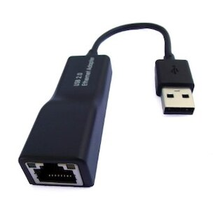

# USB Driver for REALTEK RTL8150L 

The RTL8150L controller is a 48-pin LQFP single chip that supports USB to 10/100Mbps Fast
Ethernet function. The Realtek RTL8150L(M) is a highly integrated and cost-effective single-chip Fast Ethernet
controller that provides USB to Fast Ethernet capability.

The RTL8150L(M) keeps network maintenance cost low and eliminates usage barriers. It is the
easiest way to connect a PC to the computer network without opening the cover, adding cards,
reconfiguring software, or any of the other technicalities.

In this repository, we write a USB driver for RTL8150L whose USB port is used to read and write control commands as well as data from or
to the host machine, and the Ethernet interface device instance is allocated and populated to send and receive network packets. For the 
USB packet transmission, asynchronous URB submission approach is used for throughput maximization purpose.

In addition, the network statistics such as Ethernet link status as well as network package QoR are supported to allow users program check
the operating status of the RTL8150L.
